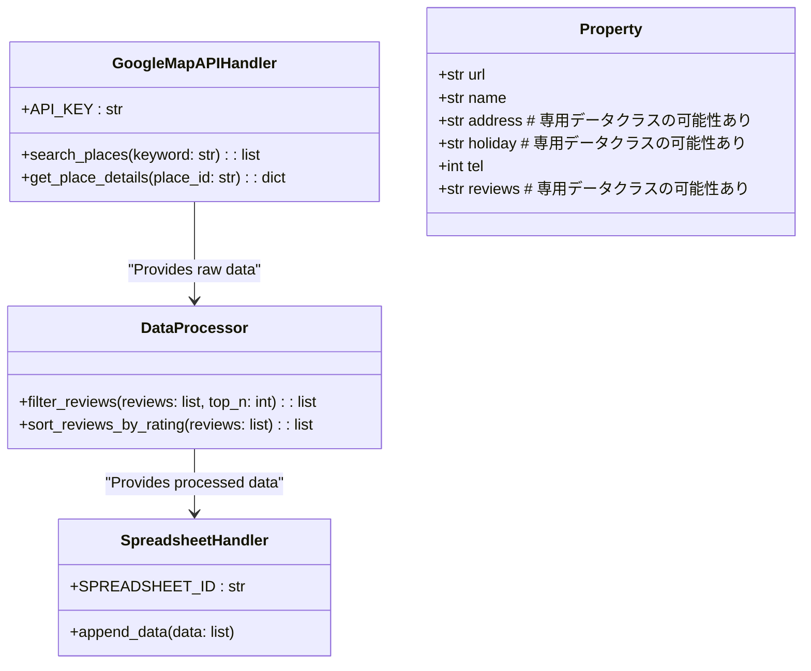

```mermaid
    classDiagram
        class GoogleMapAPIHandler {
            +API_KEY : str
            +search_places(keyword: str) : list
            +get_place_details(place_id: str) : dict
        }
        
        class DataProcessor {
            +filter_reviews(reviews: list, top_n: int) : list
            +sort_reviews_by_rating(reviews: list) : list
        }

        class SpreadsheetHandler {
            +SPREADSHEET_ID : str
            +append_data(data: list)
        }

        class Property {
            +str url
            +str name
            +str address # 専用データクラスの可能性あり
            +str holiday # 専用データクラスの可能性あり
            +int tel
            +str reviews # 専用データクラスの可能性あり
        }

        

        GoogleMapAPIHandler --> DataProcessor : "Provides raw data"
        DataProcessor --> SpreadsheetHandler : "Provides processed data"
```